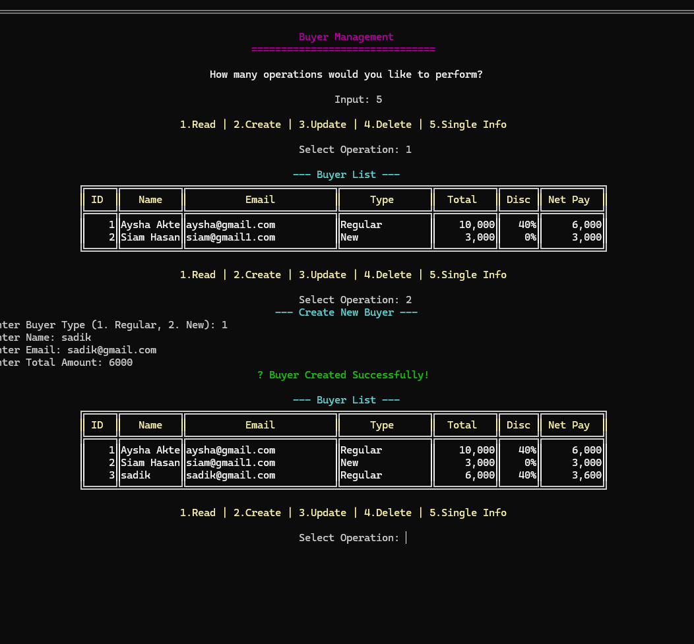

# 🛒 Buyer Management System (Factory Design Pattern)

This is a **C# Console Application** developed to demonstrate the implementation of the **Factory Design Pattern** and **Clean Architecture**.

### 🚀 Key Features
* **Factory Pattern**: Implemented to decouple object creation for different buyer types.
* **CRUD Operations**: Supports Create, Read, Update, and Delete operations.
* **Dynamic Calculations**: Automatically calculates the final amount (Net Pay).

### 🧮 Business Logic & Formula
The core logic of the application revolves around the automated calculation:
$Net Pay = Total Amount - (Total Amount \times Discount / 100)$

### 📂 Project Structure
* **Entities**: Buyer properties and data models.
* **Factory**: Logic for creating buyer objects.
* **Manager**: Business logic and data flow.
* **Repositories**: In-memory data storage.

### 📸 Preview
Below is a screenshot of the system in action:

*(Note: ID 3 correctly shows a 40% discount applied to a 6,000 BDT purchase)*
